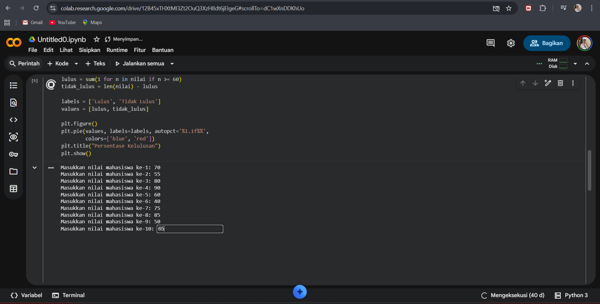
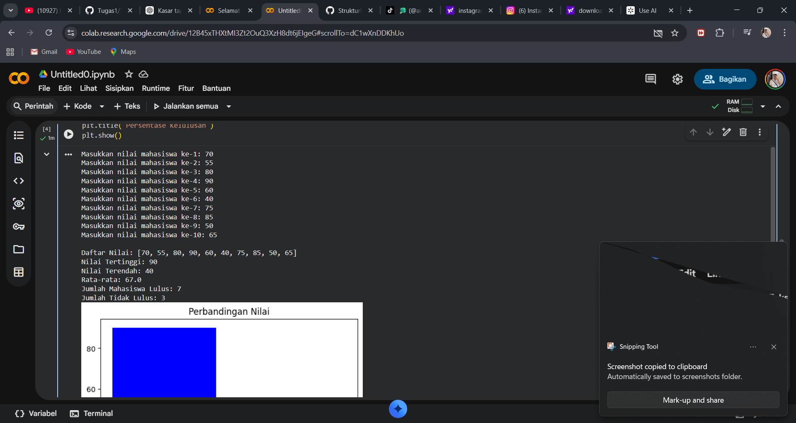
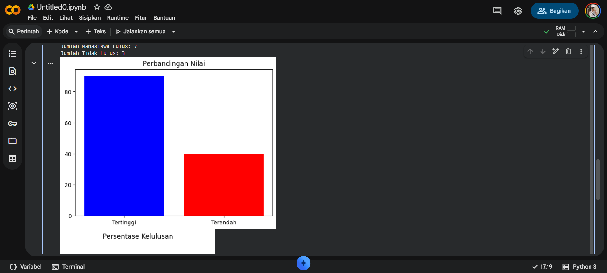
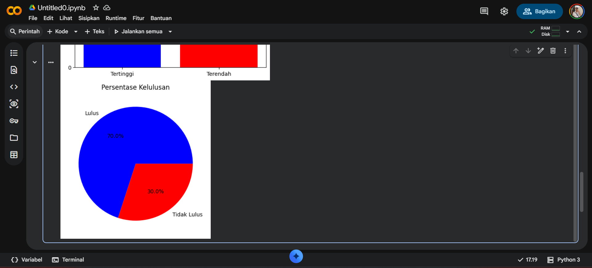

# Program Pengelolaan Nilai Mahasiswa

## Penjelasan Konsep Array

Array adalah struktur data yang digunakan untuk menyimpan beberapa data dalam satu variabel dengan tipe yang sama, sehingga data lebih mudah diatur dan diakses.

Pada program ini, array `nilai` digunakan untuk menyimpan 10 nilai mahasiswa yang diinput oleh pengguna. Setiap nilai yang dimasukkan akan ditambahkan ke dalam array menggunakan fungsi `append()`.

Setelah data tersimpan, array tersebut diproses untuk mendapatkan informasi seperti nilai tertinggi, nilai terendah, dan rata-rata. Proses ini dilakukan dengan bantuan perulangan serta fungsi bawaan Python seperti `max()`, `min()`, dan `sum()`.

Penggunaan array dalam program ini mempermudah pengolahan data karena semua nilai disimpan dalam satu struktur yang sama dan dapat diproses secara berurutan.

## Screenshot 

### Input

### Output

### Grafik

## Analisis Kompleksitas

Program ini mengolah data nilai mahasiswa yang disimpan dalam array dengan jumlah data sebanyak n.

Beberapa proses yang terjadi:

Input data: O(n)
Program meminta input sebanyak 10 kali, sehingga bergantung pada jumlah data.
Mencari nilai tertinggi dan terendah: O(n)
Program harus mengecek seluruh isi array untuk menentukan nilai maksimum dan minimum.
Menghitung rata-rata: O(n)
Semua nilai dijumlahkan terlebih dahulu sebelum dibagi jumlah data.
Menghitung jumlah lulus: O(n)
Setiap nilai dicek satu per satu untuk menentukan apakah memenuhi syarat kelulusan.

Karena hampir semua proses melibatkan pengecekan seluruh data, maka kompleksitas keseluruhan program adalah O(n).

Hal ini menunjukkan bahwa waktu eksekusi program akan bertambah seiring dengan bertambahnya jumlah data yang diproses.

## Refleksi Pembelajaran

Melalui pengerjaan program ini, saya memperoleh pemahaman yang lebih baik mengenai penggunaan array dalam menyimpan dan mengelola data dalam jumlah banyak secara terstruktur.

Selain itu, saya juga memahami pentingnya penggunaan perulangan dalam memproses setiap elemen data secara efisien, terutama dalam kasus pengecekan kondisi seperti penentuan kelulusan mahasiswa.

Pemanfaatan fungsi bawaan Python seperti `max()`, `min()`, dan `sum()` memberikan kemudahan dalam melakukan perhitungan tanpa harus membuat logika dari awal, sehingga program menjadi lebih sederhana dan efisien.

Dalam proses pengerjaan, saya juga mulai memahami dasar analisis kompleksitas waktu, khususnya perbedaan antara O(1) dan O(n), serta bagaimana jumlah data mempengaruhi waktu eksekusi program.

Secara keseluruhan, tugas ini membantu meningkatkan pemahaman saya dalam pengolahan data, penggunaan struktur data array, serta penerapan konsep dasar algoritma dalam pemrograman.
